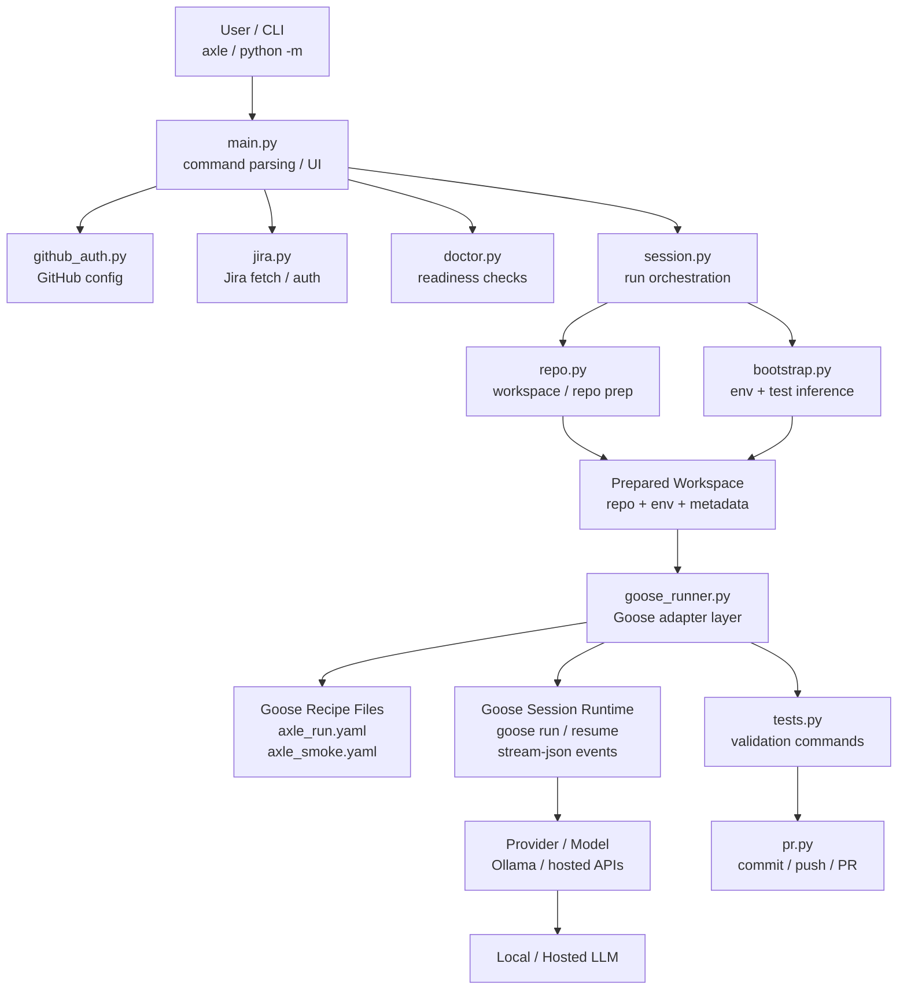

# Axle CLI

Terminal-first CLI for the Axle repo. This app is separate from the dashboard stack and uses Goose as the only execution engine. Axle handles repo setup, terminal output, tests, and PR creation around that Goose session.



Axle owns:
- CLI UX
- config/auth
- Jira/GitHub integration
- workspace creation/reuse
- environment bootstrap
- test execution
- PR flow

Goose owns:
- session continuity
- recipe-driven execution
- provider/model runtime
- tool-enabled coding loop

Axle now runs Goose with a stable workspace session, a bundled recipe, and structured output. That means `axle run KAN-2 --chat` continues the same Goose session instead of rebuilding the whole task string from scratch.

## Install

From the repository root:

```bash
cd cli_agent
python3 -m venv .venv
source .venv/bin/activate
pip install -e .
```

After installation, use the `axle` command directly:

```bash
axle status
axle doctor
```

## Container Build

Build the CLI image with Goose installed at image-build time:

```bash
docker compose --profile cli build cli_agent
```

Run the CLI in the container:

```bash
docker compose --profile cli run --rm cli_agent axle status
```

The container includes:

- Python runtime for `axle`
- `git`
- Goose CLI installed during the Docker build

Override the Goose version if needed:

```bash
docker compose --profile cli build --build-arg GOOSE_VERSION=v1.19.1 cli_agent
```

## Configure

Save GitHub access and a default repo:

```bash
axle auth github --token <github-token> --repo https://github.com/your-org/your-repo.git --branch main
```

Save Goose / model settings:

```bash
axle auth llm --provider openrouter --model qwen/qwen3-coder:free --api-key <llm-key> --base-url https://openrouter.ai/api/v1
```

Save Jira access and an optional default project:

```bash
axle auth jira --base-url https://your-domain.atlassian.net --email you@company.com --api-token <jira-token> --project APP
```

Optional Goose configuration:

```bash
axle config set-goose --binary goose --builtin developer
```

To override the built-in recipe, point Axle at a local Goose recipe file:

```bash
axle config set-goose --recipe /path/to/custom-recipe.yaml
```

## Run

Save a default test command for the repo:

```bash
axle init --repo https://github.com/your-org/your-repo.git --branch main --test "python manage.py test"
```

Fetch a Jira ticket:

```bash
axle jira KAN-2
```

Run the coding flow with the shorthand command:

```bash
axle run KAN-2
```

Run with an explicit operator instruction and PR creation:

```bash
axle run KAN-2 --task "Keep the patch narrow and add focused tests only." --pr
```

If Goose is installed, the CLI invokes it using the official `goose run` flow in the checked-out repo workspace. Goose is the only coding engine; Axle does not run any separate planner/editor/reviewer stack.
Axle uses `goose recipe validate` as the recipe contract and `goose run --output-format stream-json` for structured agent output when available.

## Session And Recipe Model

Axle now treats Goose as a sessioned agent runtime instead of a stateless text generator.

- Axle owns task intake, workspace prep, bootstrap, validation, and PR orchestration.
- Goose owns the coding session, provider/model runtime, recipe-backed behavior, and structured agent output.
- Each reusable Axle workspace gets a stable Goose session name.
- Axle defaults to the built-in Goose recipe at `axle_cli/recipes/axle_run.yaml`.
- Repair passes and `--chat` follow-ups resume the same Goose session for that workspace.

For repeatable provider checks before a full coding run:

```bash
axle doctor
axle smoke
```

## Short Demo Flow

```bash
axle init --repo https://github.com/Mridul009/lister.git --branch main --test "python manage.py test"
axle status
axle doctor
axle smoke
axle jira KAN-2
axle run KAN-2
```

For an interactive follow-up loop after the first run:

```bash
axle run KAN-2 --chat
```
