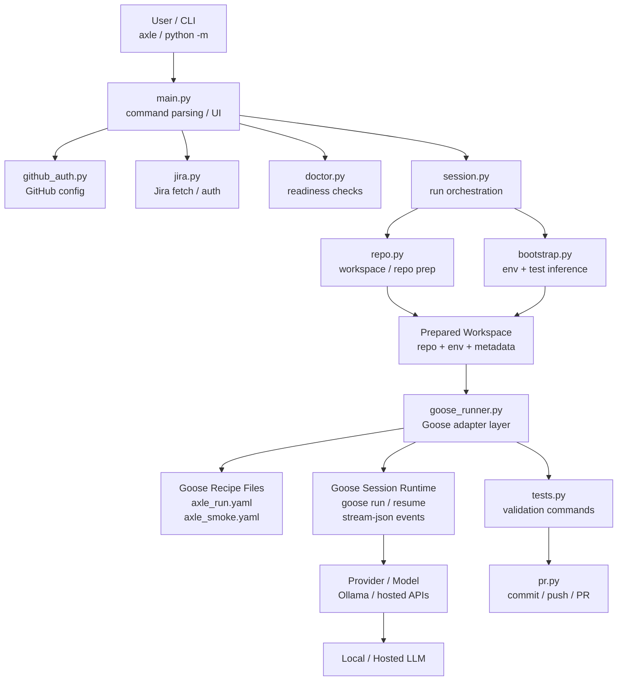

# Axle CLI

Terminal-first CLI for the Axle repo. This app is separate from the dashboard stack and uses Goose as the only execution engine. Axle handles repo setup, terminal output, tests, and PR creation around that Goose session.



Axle owns:
- CLI UX
- config/auth
- Jira/GitHub integration
- workspace creation/reuse
- environment bootstrap
- test execution
- PR flow

Goose owns:
- session continuity
- recipe-driven execution
- provider/model runtime
- tool-enabled coding loop

Axle now runs Goose with a stable workspace session, a bundled recipe, and structured output. That means `axle run KAN-2 --chat` continues the same Goose session instead of rebuilding the whole task string from scratch.

## Coordinator Mode

Axle also supports a coordinator/worker deployment path:

- `axle coordinator serve` exposes a real HTTP API.
- run state and queue state default to file-backed demo storage.
- set `AXLE_RUN_STORE=sqlite` or `AXLE_SQLITE_PATH=...` to switch to SQLite-backed durability.
- workers self-register over HTTP, claim queued runs, and post authenticated callbacks.
- workers upload transcript, diff, test log, and run summary artifacts back to the coordinator.
- Jira webhook requests can be gated with `AXLE_JIRA_WEBHOOK_SECRET` or `AXLE_WEBHOOK_SECRET`.
- webhook payloads may also be signed with `X-Axle-Webhook-Signature` or `X-Hub-Signature-256` using the same shared secret.
- only Jira issue-created and issue-updated events create runs; comment-only or other webhook types are rejected.
- the older file-backed store remains available for local demo flows.
- routing is configurable in `axle_cli/coordinator/routing.json`, with an `AXLE_ROUTING_CONFIG` override.
- routing supports precedence control, named profiles, per-project overrides, and rule priorities.
- coordinator artifact storage defaults to `.axle-cli/coordinator/artifacts/` and can be overridden with `AXLE_ARTIFACT_STORE_ROOT`.
- webhook idempotency markers live under `.axle-cli/coordinator/idempotency/` in file mode.
- EC2-backed runs can reconcile instance state through `DescribeInstances` and terminate orphaned workers during recovery or cleanup.

Start a coordinator:

```bash
axle coordinator serve \
  --host 0.0.0.0 \
  --port 8080 \
  --admin-token change-me-admin \
  --worker-token change-me-worker \
  --webhook-secret change-me-webhook \
  --worker-launch-mode planned
```

For a single-machine demo where the coordinator launches the worker locally on the same host, use:

```bash
axle coordinator serve \
  --host 127.0.0.1 \
  --port 8080 \
  --admin-token change-me-admin \
  --webhook-secret change-me-webhook \
  --demo-local-worker
```

That flag makes webhook-created runs spawn `python -m axle_cli.worker.entrypoint run ...` on the coordinator machine, so you do not need a separate polling worker process for the demo.

Queue a run over HTTP:

```bash
curl -X POST http://127.0.0.1:8080/api/webhooks/runs \
  -H "Authorization: Bearer change-me-admin" \
  -H "X-Axle-Jira-Webhook-Secret: change-me-webhook" \
  -H "Content-Type: application/json" \
  -d '{
    "run_id": "run-123",
    "task": "Fix the failing test and open a PR",
    "repository": "https://github.com/your-org/your-repo.git",
    "base_branch": "main",
    "status": "queued"
  }'
```

Start a worker:

```bash
axle worker poll \
  --coordinator-url http://127.0.0.1:8080 \
  --worker-token change-me-worker
```

For the simplest local demo, use the bundled helper commands:

```bash
axle-demo-coordinator
axle-demo-worker
```

Or run the coordinator-only local-launch demo:

```bash
axle-demo-coordinator --demo-local-worker
```

These default to:

- host: `127.0.0.1`
- port: `8080`
- run store: `file`
- admin token: `demo-admin`
- worker token: `demo-worker`
- webhook secret: `demo-webhook`

Override them with:

- `AXLE_DEMO_HOST`
- `AXLE_DEMO_PORT`
- `AXLE_DEMO_ADMIN_TOKEN`
- `AXLE_DEMO_WORKER_TOKEN`
- `AXLE_DEMO_WEBHOOK_SECRET`
- `AXLE_DEMO_COORDINATOR_URL`
- `AXLE_DEMO_RUN_STORE`

For the Docker + Jira demo flow, use the wrapper in [`ops/axle-demo-docker.sh`](/Users/mshukl/Documents/DataAxle/code/cli_agent/ops/axle-demo-docker.sh):

```bash
chmod +x ops/axle-demo-docker.sh
alias axle-demo='./ops/axle-demo-docker.sh'
```

Demo wrapper commands:

```bash
axle-demo logs
axle-demo coordinator-logs
axle-demo worker-logs
axle-demo watch <run_id>
axle-demo show <run_id>
axle-demo latest
axle-demo latest-show
axle-demo latest-watch
axle-demo ps
axle-demo health
axle-demo config
axle-demo last-pr
axle-demo restart
axle-demo jira-trigger <payload.json>
axle-demo jira-smoke
axle-demo jira-multifile
```

Use `logs` for live coordinator and worker output. Use `watch <run_id>` for a live run view until completion. Use `show <run_id>` for a one-shot summary.

`latest`, `latest-show`, and `latest-watch` are the fastest demo helpers when Jira has already triggered a run and you do not yet know the run id.

`jira-smoke` and `jira-multifile` are the built-in trigger helpers for the common demo payloads. `jira-trigger <payload.json>` lets you POST a custom Jira webhook body.

Live commands:

- `logs`
- `coordinator-logs`
- `worker-logs`
- `watch <run_id>`
- `latest-watch`

One-shot commands:

- `show <run_id>`
- `latest`
- `latest-show`
- `ps`
- `health`
- `config`
- `last-pr`
- `restart`
- `jira-trigger <payload.json>`
- `jira-smoke`
- `jira-multifile`

Default assumptions:

- coordinator container: `axle-coordinator`
- worker container: `axle-worker`
- base URL: `http://127.0.0.1`
- admin token: `change-me-admin`

Override them with:

- `AXLE_DEMO_COORDINATOR_CONTAINER`
- `AXLE_DEMO_WORKER_CONTAINER`
- `AXLE_DEMO_BASE_URL`
- `AXLE_DEMO_ADMIN_TOKEN`
- `AXLE_DEMO_POLL_SECONDS`
- `AXLE_DEMO_CLI_HOME`
- `AXLE_DEMO_RUNS_DIR`
- `AXLE_DEMO_ISSUE_KEY`
- `AXLE_DEMO_PROJECT_KEY`
- `AXLE_DEMO_LABEL`

Recover stale runs or clear orphaned workers:

```bash
axle coordinator recover --stale-after-seconds 3600
axle coordinator cleanup-orphans --stale-after-seconds 300
```

Routing rules can target Jira project keys, labels, and components. Named profiles can be reused by rules and project entries, and the `precedence` list controls whether saved CLI config, defaults, project overrides, or matching rules win last.

## Artifact Storage

Run artifacts are written to the coordinator-local filesystem by default:

- `goose-transcript.log`
- `changes.patch`
- `test.log`
- `summary.json`

The default root is `.axle-cli/coordinator/artifacts/<run-id>/`. Set `AXLE_ARTIFACT_STORE_ROOT` to move that location, or pass `--artifact-root` to `axle coordinator serve`.

## Install

From the repository root:

```bash
cd cli_agent
python3 -m venv .venv
source .venv/bin/activate
pip install -e .
```

After installation, use the `axle` command directly:

```bash
axle status
axle doctor
```

## Container Build

Build the CLI image with Goose installed at image-build time:

```bash
docker compose --profile cli build cli_agent
```

Run the CLI in the container:

```bash
docker compose --profile cli run --rm cli_agent axle status
```

The container includes:

- Python runtime for `axle`
- `git`
- Goose CLI installed during the Docker build

Override the Goose version if needed:

```bash
docker compose --profile cli build --build-arg GOOSE_VERSION=v1.19.1 cli_agent
```

Run the same image as a coordinator service:

```bash
docker run --rm -p 8080:8080 \
  -e AXLE_CLI_HOME=/data/.axle-cli \
  -v "$PWD/.axle-cli:/data/.axle-cli" \
  axle-cli-agent \
  axle coordinator serve --host 0.0.0.0 --port 8080 --admin-token change-me-admin --worker-token change-me-worker --webhook-secret change-me-webhook
```

Deployment examples are in `ops/docker-compose.coordinator.yml` and `ops/axle-coordinator.service`.
The EC2 launch spec now writes a structured bootstrap manifest, passes the run callback token cleanly, and can terminate the instance on worker exit when `terminate_on_finish` is enabled.

## EC2 Worker Launching

To let the coordinator spawn a fresh EC2 worker per run, start the coordinator with:

```bash
axle coordinator serve \
  --host 0.0.0.0 \
  --port 8080 \
  --coordinator-url https://coordinator.example \
  --worker-launch-mode ec2
```

And set these environment variables on the coordinator instance:

- `AXLE_EC2_AMI_ID`
- `AXLE_EC2_INSTANCE_TYPE`
- `AXLE_EC2_SUBNET_ID`
- `AXLE_EC2_SECURITY_GROUP_ID` or `AXLE_EC2_SECURITY_GROUP_IDS`
- `AXLE_EC2_INSTANCE_PROFILE_NAME`
- `AXLE_EC2_KEY_NAME`
- `AXLE_EC2_ASSOCIATE_PUBLIC_IP_ADDRESS`
- `AXLE_EC2_TERMINATE_ON_FINISH`

When `--worker-launch-mode ec2` is enabled, `--coordinator-url` is required so the launched instance can call back to the coordinator over HTTP.

## Configure

Save GitHub access and a default repo:

```bash
axle auth github --token <github-token> --repo https://github.com/your-org/your-repo.git --branch main
```

Save Goose / model settings:

```bash
axle auth llm --provider openrouter --model qwen/qwen3-coder:free --api-key <llm-key> --base-url https://openrouter.ai/api/v1
```

Save Jira access and an optional default project:

```bash
axle auth jira --base-url https://your-domain.atlassian.net --email you@company.com --api-token <jira-token> --project APP
```

Optional Goose configuration:

```bash
axle config set-goose --binary goose --builtin developer
```

To override the built-in recipe, point Axle at a local Goose recipe file:

```bash
axle config set-goose --recipe /path/to/custom-recipe.yaml
```

## Run

Save a default test command for the repo:

```bash
axle init --repo https://github.com/your-org/your-repo.git --branch main --test "python manage.py test"
```

Fetch a Jira ticket:

```bash
axle jira KAN-2
```

Run the coding flow with the shorthand command:

```bash
axle run KAN-2
```

Run with an explicit operator instruction and PR creation:

```bash
axle run KAN-2 --task "Keep the patch narrow and add focused tests only." --pr
```

If Goose is installed, the CLI invokes it using the official `goose run` flow in the checked-out repo workspace. Goose is the only coding engine; Axle does not run any separate planner/editor/reviewer stack.
Axle uses `goose recipe validate` as the recipe contract and `goose run --output-format stream-json` for structured agent output when available.

## Session And Recipe Model

Axle now treats Goose as a sessioned agent runtime instead of a stateless text generator.

- Axle owns task intake, workspace prep, bootstrap, validation, and PR orchestration.
- Goose owns the coding session, provider/model runtime, recipe-backed behavior, and structured agent output.
- Each reusable Axle workspace gets a stable Goose session name.
- Axle defaults to the built-in Goose recipe at `axle_cli/recipes/axle_run.yaml`.
- Repair passes and `--chat` follow-ups resume the same Goose session for that workspace.

For repeatable provider checks before a full coding run:

```bash
axle doctor
axle smoke
```

## Short Demo Flow

```bash
axle init --repo https://github.com/Mridul009/lister.git --branch main --test "python manage.py test"
axle status
axle doctor
axle smoke
axle jira KAN-2
axle run KAN-2
```

For an interactive follow-up loop after the first run:

```bash
axle run KAN-2 --chat
```
